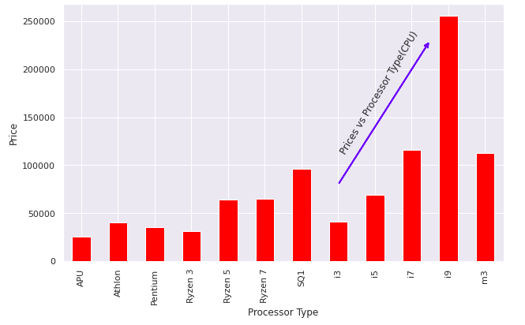
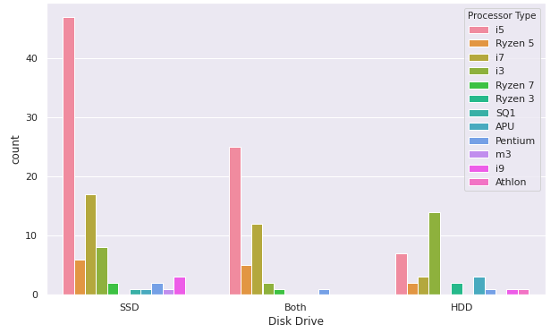
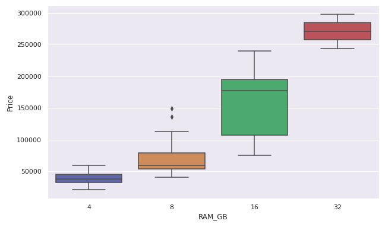
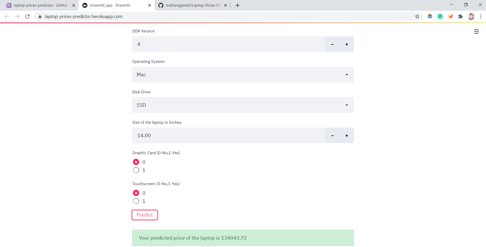

# Laptop Prices Predictor
<ul>
  <li>Designed a web app that predicts the price of the laptop given the configurations. </li>
  <li>Scraped the laptops data from flipkart.com using python and BeautifulSoup package</li>
  <li>Developed Linear, Lasso, and Random Forest Regressors using GridsearchCV to get the best model.</li>
  <li>Deployed the Machine Learning model using streamlit library in Heroku using flask</li>
</ul>

# Links and Resources Used
<li>PyCaret Library: <a href="https://pycaret.org/">https://pycaret.org/</a></li>
<li>Streamlit Library: <a href="https://www.streamlit.io/">https://www.streamlit.io/</a>
<li>Model Deployment Video: <a href="https://www.youtube.com/watch?v=IWWu9M-aisA">https://www.youtube.com/watch?v=IWWu9M-aisA</a></li>
<li>Model Deployment Github: <a href="https://github.com/krishnaik06/Dockers">https://github.com/krishnaik06/Dockers</a></li>
<li>Packages: pandas, numpy, sklearn, flask, streamlit, joblib</li>

# Web Scraping

This is the Flipkart website comprising of different laptops. This page contains the specifications of 24 laptops. So now looking at this, we try to extract the different features of the laptops such as:
<ul>
  <li> Description</li>
  <li>Processor</li>
  <li>RAM</li>
  <li>Storage</li>
  <li>Display</li>
  <li>Warranty</li>
  <li>Price</li>
</ul>
So we extract the data from 7 pages so our dataset now consists of the information the 168 different laptops.  
Link to my article: https://towardsdatascience.com/learn-web-scraping-in-15-minutes-27e5ebb1c28e

# Feature Engineering
We go through all the features one by one and keep adding new features. I have made the following changes and created new variables:
RAM - Made columns for Ram Capacity in GB and the DDR version  
Processor - Made columns for Name of the Processor, Type of the Processor, Generation  
Operating System - Parsed the Operating System from this column and made a new column  
Storage - Made new columns for the type of Disk Drive and the capacity of the Disk Drive  
Display - Made new columns for the size of the laptop(in inches) and touchscreen  
Description - Made new columns for the company and graphic card  

# Data Preprocessing
There are a few columns which are categorical here but they actually contain numerical values.So we need to convert few categorical columns to numerical columns. These are DDR_Version,Generation,Storage_GB,Price.

# Exploratory Data Analysis
     

# Model Building
<li>Traditional Method</li>
Used scikit-learn library for the Machine Learning tasks. Applied label encoding and converted the categorical variables into numerical ones.Then I splited the data into training and test sets with a test size of 20%. I tried three different models ( Linear Regression, Random Forest Regression, XGBoost) and evaluated them using Mean Absolute Error. 

<li>Automated Method</li>
Used the auto ML library in python called PyCaret. Compared all the regression models and selected the best model for applied hyperparameter tuning and plotted the various curves.

Link to my article: <a href="https://towardsdatascience.com/leverage-the-power-of-pycaret-d5c3da3adb9b">https://towardsdatascience.com/leverage-the-power-of-pycaret-d5c3da3adb9b</a>

# Model Deployment
I have deployed the model using Streamlit library and flask framework on Heroku which is a Platform As A Service(PAAS)

Web application: <a href="https://laptop-prices-predictor.herokuapp.com/">https://laptop-prices-predictor.herokuapp.com/</a>
